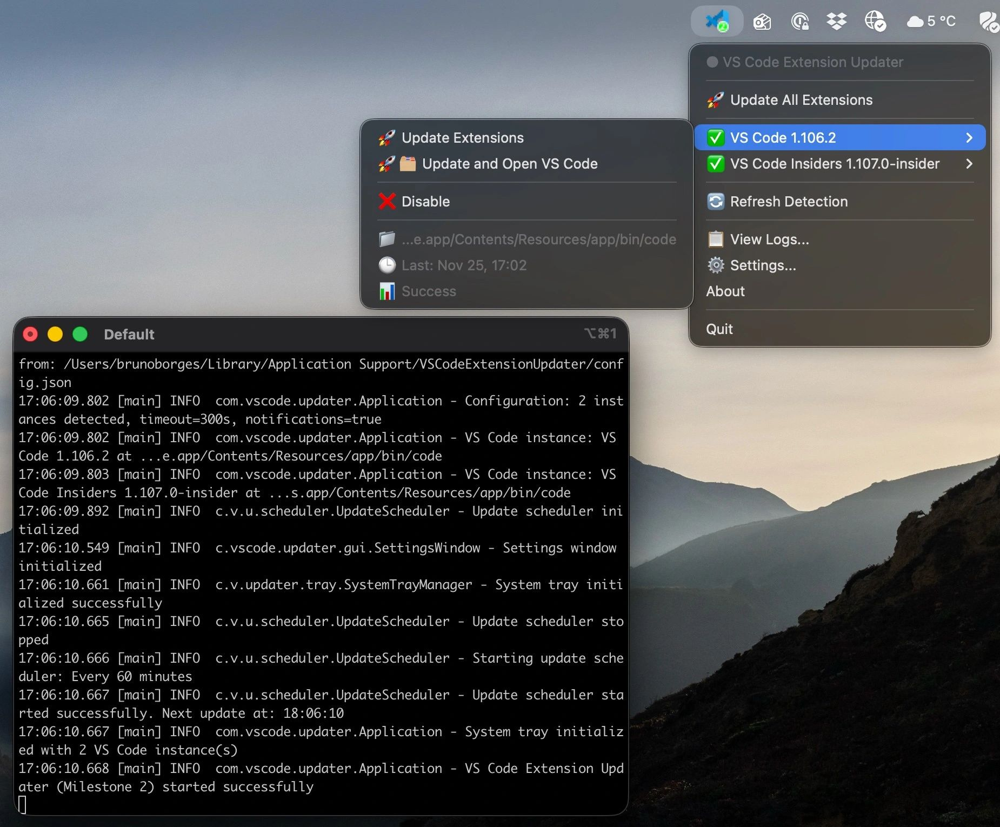

# Introducing VS Code Extension Updater: Never Worry About Outdated Extensions Again

*Keep your VS Code extensions up-to-date automatically with this lightweight system tray application*



If you're a VS Code power user like me, you probably have dozens of extensions installed across multiple VS Code instances (Stable, Insiders, maybe some portable versions). Keeping all these extensions updated manually can be a real pain. That's why I built **VS Code Extension Updater** – a lightweight Java application that runs quietly in your system tray and automatically manages extension updates for all your VS Code installations.

## The Problem: Extension Update Fatigue

VS Code is fantastic, but managing extensions across multiple instances quickly becomes tedious:

- 🔄 **Manual Updates**: Having to check for updates manually in each VS Code instance
- 🔀 **Multiple Instances**: Managing Stable, Insiders, and portable versions separately  
- ⏰ **Time Consuming**: Interrupting your workflow to handle extension updates
- 😴 **Forgotten Updates**: Missing important security and feature updates
- 🎯 **Inconsistent State**: Having different extension versions across instances

## The Solution: Automated Background Updates

VS Code Extension Updater solves these problems by providing:

### 🎯 **Smart Multi-Instance Detection**

The application automatically discovers all VS Code installations on your system:
- **VS Code Stable** - Your primary development environment
- **VS Code Insiders** - Preview builds with cutting-edge features
- **Portable Installations** - Custom VS Code setups
- **User-specific Profiles** - Different configurations for different projects


### 🚀 **Flexible Update Operations**

Choose how you want updates to happen:

**Standard Updates**: Quietly update extensions in the background without interrupting your work.

**Update & Launch**: Perfect for your morning routine – updates extensions and automatically opens VS Code, ready for the day.

**Scheduled Updates**: Set it and forget it. Configure automatic updates to run:
- Every few hours during work time
- Once daily during lunch break  
- Weekly on weekends
- Custom schedules using cron expressions

### 🖥️ **Native System Integration**

The application integrates seamlessly with your operating system:

- **System Tray Icon**: Lightweight presence that doesn't clutter your desktop
- **Cross-Platform**: Native installers for Windows, macOS, and Linux
- **Professional Branding**: Custom application icons throughout the system
- **Context Menus**: Right-click the tray icon for quick access to all features

## Technical Excellence: Built for Reliability

### ⚡ **Performance Optimized**

- **Lightweight Footprint**: Only 16-64MB memory usage
- **Custom Java Runtime**: Embedded JRE means no Java installation required
- **Optimized Modules**: Only includes necessary Java components (55% size reduction)
- **Efficient Updates**: Concurrent processing with configurable limits

### 🛡️ **Enterprise-Grade Features**

- **Session-Based Logging**: Track every update operation with detailed logs
- **Error Handling**: Robust error recovery and user notifications  
- **Configuration Management**: JSON-based settings with validation
- **Idle Detection**: Only update when your system isn't busy

### 📦 **Professional Distribution**

#### Windows: MSI Installer Package
- One-click installation with Windows Installer
- Code signing support for enhanced security
- Professional Windows integration (Start Menu, shortcuts, uninstaller)
- System tray integration with native Windows APIs

#### macOS: PKG Installer Package  
- Native macOS installer with proper app bundle
- Code signing and notarization support for Gatekeeper compatibility
- Professional integration with Finder, Dock, and Launchpad
- Custom ICNS icon for consistent branding

#### Linux: Portable JAR
- Universal compatibility across distributions
- Desktop integration files included
- Custom launcher scripts for system integration

## Real-World Usage Scenarios

### 🌅 **Morning Routine Developer**
*"I configured it to run 'Update & Launch' every morning at 9 AM. By the time I sit down with my coffee, VS Code is open with all extensions updated and ready to go."*

### 🔄 **Continuous Integration Enthusiast**  
*"I have it checking for updates every 2 hours during work time. Never again will I miss a crucial extension update that fixes a bug I'm struggling with."*

### 💻 **Multi-Setup Developer**
*"I maintain VS Code Stable for production work and Insiders for experimental projects. The app keeps both instances perfectly synchronized with the latest extension versions."*

### 🏢 **Team Lead**
*"I configured identical update schedules across my team's development machines. Everyone stays on the same extension versions, reducing environment-related issues."*

## Getting Started: Installation Made Easy

### Option 1: One-Click Installers (Recommended)

**Windows**: Download the MSI package from the releases page. Double-click to install – the application will automatically start in your system tray.

**macOS**: Download the PKG package and install. The app will appear in your Applications folder and menu bar.

### Option 2: Build from Source

```bash
# Clone the repository
git clone https://github.com/brunoborges/vsc-extensions-updater.git
cd vsc-extensions-updater

# Build application JAR
mvn clean package

# Run directly
java -jar target/extension-updater-1.0.jar --system-tray

# Or build installers
# Windows: .\build-windows-installer.ps1
# macOS: ./build-macos-installer.sh
```

## Configuration: Fine-Tune Your Experience

The application creates a user-friendly configuration file at:
- **Windows**: `%APPDATA%/vscode-extension-updater/config.json`
- **macOS**: `~/Library/Application Support/vscode-extension-updater/config.json`  
- **Linux**: `~/.config/vscode-extension-updater/config.json`

### Sample Configuration

```json
{
  "updateFrequency": "EVERY_4_HOURS",
  "maxConcurrentUpdates": 2,
  "enableNotifications": true,
  "vscodeInstances": {
    "VS Code Stable": {
      "enabled": true,
      "path": "/Applications/Visual Studio Code.app"
    },
    "VS Code Insiders": {
      "enabled": true,
      "path": "/Applications/Visual Studio Code - Insiders.app"
    }
  },
  "scheduling": {
    "workingHoursOnly": true,
    "startHour": 9,
    "endHour": 18
  }
}
```

## The Technology Stack: Modern Java Done Right

Built with modern Java practices and tools:

- **Java 21+**: Latest LTS with performance improvements and language features
- **Maven**: Reliable dependency management and build automation
- **Swing**: Native-looking GUI components for cross-platform consistency
- **JSON Configuration**: Human-readable settings with schema validation
- **SLF4J + Logback**: Professional logging with configurable output
- **jlink + jpackage**: Modern Java deployment with custom runtimes

### Why Java?

While some might question using Java for a desktop application in 2024, here's why it was the perfect choice:

1. **True Cross-Platform**: Write once, run everywhere – literally
2. **Enterprise Reliability**: Battle-tested in production environments worldwide  
3. **Rich Ecosystem**: Mature libraries for every need
4. **Performance**: Modern JVMs are incredibly fast and efficient
5. **Easy Distribution**: jpackage creates native installers with embedded runtimes
6. **Maintainability**: Strong typing and tooling make the codebase robust

## Advanced Features for Power Users

### 📊 **Comprehensive Logging**
Every update operation is logged with detailed information:
- Extension name and version changes
- Update duration and success/failure status
- VS Code instance being updated
- Command output and error messages
- Session-based organization for easy troubleshooting

### 🎛️ **GUI Management Interface**
While designed to run in the background, a full GUI is available:
- **Settings Window**: Configure all options through a user-friendly interface
- **Log Viewer**: Real-time log display with filtering and export capabilities
- **About Dialog**: Version information and system details

### 🔧 **Developer-Friendly Features**
- **REST API**: Optional web interface for programmatic control (planned)
- **Command-Line Interface**: Full CLI support for automation and scripting
- **Exit Codes**: Proper exit codes for integration with other tools
- **Configuration Validation**: Detailed error messages for invalid settings

## Security and Privacy: Your Data Stays Yours

Privacy and security are paramount:

- **No Data Collection**: The application doesn't send any data to external servers
- **Local Configuration**: All settings stored locally on your machine  
- **Open Source**: Full source code available for inspection
- **Code Signing**: Installers are properly signed for security verification
- **Minimal Permissions**: Only requires access to VS Code directories

## Contributing: Join the Community

This is an open-source project, and contributions are welcome:

- **🐛 Bug Reports**: Found an issue? Open a GitHub issue with details
- **💡 Feature Requests**: Have an idea? Let's discuss it in the discussions
- **🔧 Pull Requests**: Code contributions are always appreciated
- **📚 Documentation**: Help improve docs and tutorials
- **🧪 Testing**: Test on different platforms and configurations

### Development Setup

```bash
# Fork and clone the repository
git clone https://github.com/YOUR_USERNAME/vsc-extensions-updater.git

# Build and test
mvn clean test
mvn clean package

# Run tests with coverage
mvn test jacoco:report
```

## Roadmap: What's Coming Next

The project is actively developed with exciting features planned:

### 🚀 **Version 2.0 (Q1 2025)**
- **Extension Profiles**: Save and restore extension sets for different projects
- **Team Sync**: Share extension configurations across team members
- **Rollback Support**: Undo extension updates if something breaks
- **Update Exclusions**: Skip specific extensions from automatic updates

### 🎯 **Version 2.5 (Q2 2025)**  
- **VS Code Settings Sync**: Keep settings synchronized across instances
- **Marketplace Integration**: Browse and install extensions directly from the app
- **Update Analytics**: Track update patterns and extension usage
- **Advanced Scheduling**: More granular scheduling options and triggers

### 🔮 **Future Versions**
- **Plugin Architecture**: Support for custom update behaviors
- **Enterprise Features**: Centralized configuration management
- **Integration APIs**: Connect with other development tools
- **AI-Powered Recommendations**: Suggest relevant extensions based on usage

## Conclusion: Streamline Your Development Workflow

VS Code Extension Updater transforms extension management from a tedious manual task into a seamless automated process. Whether you're a solo developer wanting to stay current with the latest tools, or a team lead ensuring consistency across development environments, this tool integrates naturally into your workflow.

The combination of intelligent automation, professional system integration, and thoughtful user experience design makes it an essential tool for any serious VS Code user. Best of all, it's completely free and open-source.

**Ready to never worry about extension updates again?**

[**Download VS Code Extension Updater**](https://github.com/brunoborges/vsc-extensions-updater/releases) | [**View Source Code**](https://github.com/brunoborges/vsc-extensions-updater) | [**Read Documentation**](https://github.com/brunoborges/vsc-extensions-updater#readme)

---

*Have questions or feedback? I'd love to hear from you! Connect with me on [GitHub](https://github.com/brunoborges) or open an issue in the project repository.*

---

**Tags:** VS Code, Extensions, Automation, Java, Desktop Applications, Developer Tools, System Tray, Cross-Platform, Open Source